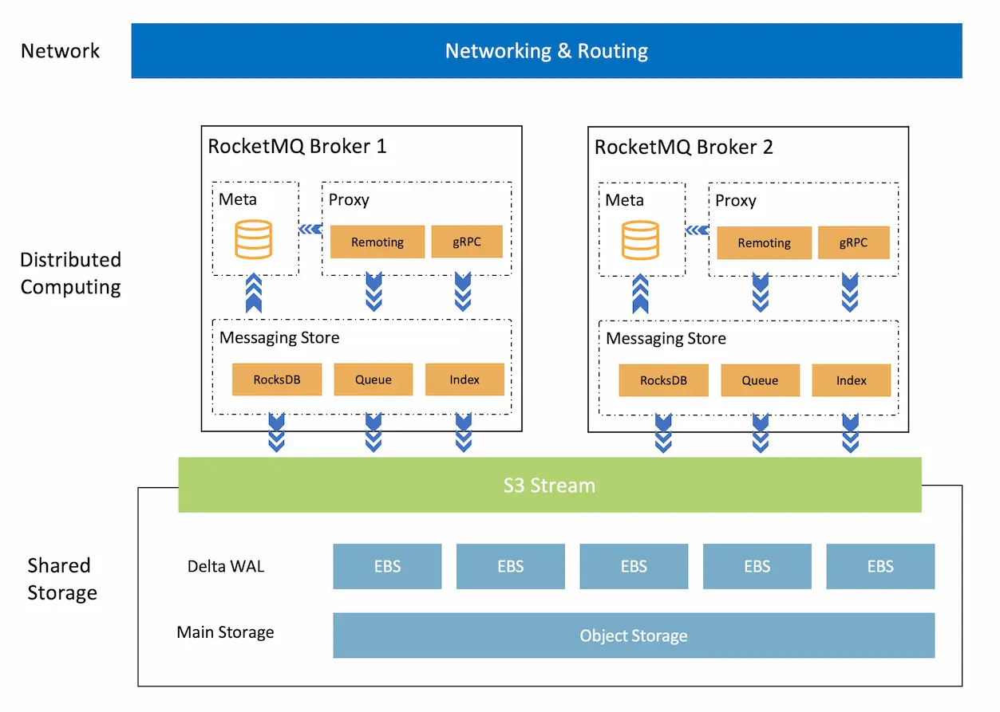

<h1 align="center">
AutoMQ for Apache RocketMQ
</h1>
<h3 align="center">
    A cloud-native implementation for Apache RocketMQ 5.0
</h3>

## What is AutoMQ for Apache RocketMQ

[![Build Status][maven-build-image]][maven-build-url]
[![Release][release-image]][release-url]
[![License][license-image]][license-url]

AutoMQ for Apache RocketMQ has been redesigned to utilize cloud infrastructure, allowing users to take advantage of
**elastic computing resources** and nearly **unlimited, cost-effective storage** in the cloud. It also ensures **100%
functional
compatibility** with Apache RocketMQ.

Compared to Apache RocketMQ, AutoMQ for Apache RocketMQ offers the following advantages:

- Enhanced Scalability: Separate storage to services rather than software, enabling seamless scaling to meet varying
  workloads. Maximize the use of Spot instances to leverage one of the most significant advantages of cloud computing:
  Elasticity.

- Cost Efficiency: Using object storage as primary storage has made the storage more resilient and provided nearly
  unlimited capacity. Additionally, shared storage architecture is better suited for migration and can save up to 80% on
  your bill.

- Simplified Management: AutoMQ for Apache RocketMQ uses a reliable metadata service and cluster controller to balance
  traffic
  between brokers and isolate abnormal nodes automatically. This greatly simplifies the management of the cluster.

## Quick Start

Pre-requirements: docker and docker-compose

1. Clone the project via git: `git clone https://github.com/AutoMQ/automq-for-rocketmq.git && cd automq-for-rocketmq`
2. Run `./distribution/docker/build.sh` to build the docker image.
3. Run `./distribution/docker/compose.sh` to start the service, which includes 1 MySQL server and 2 RocketMQ brokers.
4. Start the producer and consumer to produce and consume messages,
   See [rocketmq-clients](https://github.com/apache/rocketmq-clients) for more details.

[maven-build-image]: https://github.com/AutoMQ/automq-for-rocketmq/actions/workflows/coverage-ci.yml/badge.svg?branch=main
[maven-build-url]: https://github.com/AutoMQ/automq-for-rocketmq/actions/workflows/coverage-ci.yml
[release-image]: https://img.shields.io/badge/release-download-orange.svg
[release-url]: https://github.com/AutoMQ/automq-for-rocketmq/releases
[license-image]: https://img.shields.io/badge/license-Apache%202-4EB1BA.svg
[license-url]: https://www.apache.org/licenses/LICENSE-2.0.html
